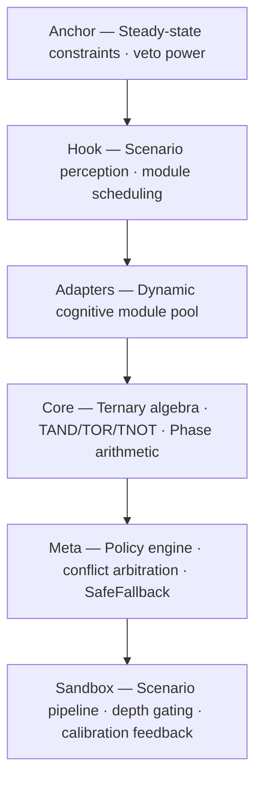

# Trit-Core v0.3.0

> **Aurora 开发者入口**: [aurora/MASTER_PLAN.md](aurora/MASTER_PLAN.md) — 今天加入项目，第一步该做什么。
>
> **双螺旋知识库**: 用 Obsidian 打开 `map/00_START_HERE.md`，探索代码与知识的交织图谱。→ [进入知识库](map/00_START_HERE.md)
>
> **叙事基准**: [docs/NARRATIVE_CHARTER.md](docs/NARRATIVE_CHARTER.md) — 产品动机统一口径。

[](https://github.com/trit-core/trit-core/actions/workflows/ci.yml)
[](https://opensource.org/licenses/MIT)
[](https://www.rust-lang.org)

A ternary decision engine for conflict-aware AI alignment, plus **Aurora** — a local-first desktop tool built on top of it.

## What this project is

**Trit-Core** is an honest cognitive calculator. Using ternary logic (True / Hold / False) and a Frame reference-system, it forces hidden conflicts in a decision into the open — and would rather output `Hold` than pretend to know.

**Aurora** is a layer of *见识-expanding input* wrapped around that calculator. It keeps feeding in the real-world dimensions that mainstream decision-AI ignores — **geography, ecology, climate, culture, customs** — to gradually widen a user's reference frame, which has been narrowed by systemic acculturation.

The product's success is **not** retention or revenue. Its success is **the user eventually no longer needing it** — when their 见识 has grown enough to do the reasoning themselves. It is open-source (MIT), free, seeks no attention, and reaches users only by self-selection: people who already have the困惑 and insight to notice its value.

> 见识 (jiànshi): "broadened perspective / expanded world-model." Any input that expands the boundary of a user's internal world-model is good — even if this decision doesn't use it, it changes the option-space of the next one. This is the opposite of a feed's dopamine reward (which reinforces existing preferences and narrows).



## Why Hold matters

Binary logic forces a choice: True or False. When scientific evidence points one way and individual circumstance points another, both answers are wrong. **The act of choosing destroys information.**

Trit-Core introduces **Hold** — intentional suspension of judgment that preserves the conflict instead of collapsing it. Hold is not "uncertain." Hold is "this should not be decided by an algorithm right now — the reference frame doesn't yet support it." Aurora's job is to widen that frame with 见识 input until Hold naturally dissolves.

```rust
use trit_core::core::{Frame, TernaryAlgebra, TritValue, TritWord};

let science     = TritWord::tru(Frame::Science);
let individual  = TritWord::fals(Frame::Individual);

let (result, interrupt) = TernaryAlgebra::t_and(&science, &individual);

assert_eq!(result.value(), TritValue::Hold); // conflict preserved, not erased
```

## 30 seconds in

```bash
cargo build --release
cargo test --all-features
cargo run --release --bin trit-sandbox -- --scenario scenarios/medical_conflict_01.json
```

## Read more

| Document | For |
|----------|-----|
| [docs/INDEX.md](docs/INDEX.md) | Full documentation map |
| [docs/tutorials/QUICKSTART.md](docs/tutorials/QUICKSTART.md) | 3 minutes from clone to first scenario |
| [docs/technical-whitepaper.md](docs/technical-whitepaper.md) | v0.3.0 technical whitepaper & audit index |

## License

MIT
