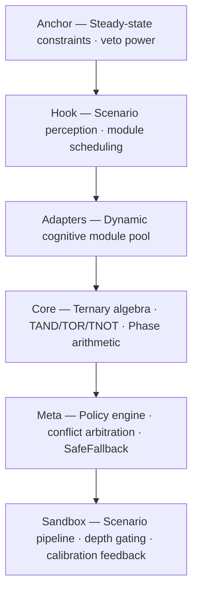

# Trit-Core v0.3.0

[](https://github.com/trit-core/trit-core/actions/workflows/ci.yml)
[](https://opensource.org/licenses/MIT)
[](https://www.rust-lang.org)

A ternary decision engine for conflict-aware AI alignment.



## Why Hold matters

Binary logic forces a choice: True or False. When scientific evidence points one way and individual circumstance points another, both answers are wrong. **The act of choosing destroys information.**

Trit-Core introduces **Hold** — intentional suspension of judgment that preserves the conflict instead of collapsing it. Hold is not "uncertain." Hold is "this should not be decided by an algorithm."

```rust
use trit_core::core::{Frame, TernaryAlgebra, TritValue, TritWord};

let science     = TritWord::tru(Frame::Science);
let individual  = TritWord::fals(Frame::Individual);

let (result, interrupt) = TernaryAlgebra::t_and(&science, &individual);

assert_eq!(result.value(), TritValue::Hold); // conflict preserved, not erased
```

## 30 seconds in

```bash
cargo build --release
cargo test --all-features
cargo run --release --bin trit-sandbox -- --scenario scenarios/medical_conflict_01.json
```

## Read more

| Document | For |
|----------|-----|
| [docs/INDEX.md](docs/INDEX.md) | Full documentation map |
| [docs/tutorials/QUICKSTART.md](docs/tutorials/QUICKSTART.md) | 3 minutes from clone to first scenario |
| [docs/technical-whitepaper.md](docs/technical-whitepaper.md) | v0.3.0 technical whitepaper & audit index |

## License

MIT
