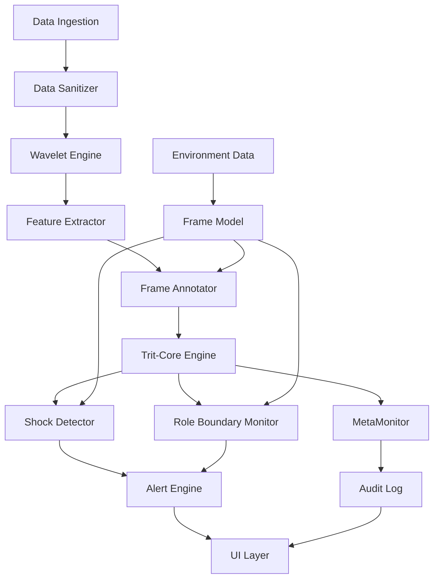

# Aurora 系统架构详细设计

**版本**: 0.1.0
**日期**: 2026-06-20
**状态**: 活跃
**分类**: 03_whitepaper — 技术白皮书

---

## 一、架构全景

```
┌─────────────────────────────────────────────────────────────────────┐
│                         应用层（Presentation）                      │
│  ├─ 注意力图谱（Attention Map）— 实时谁在关注什么、强度、方向、变化   │
│  ├─ 冲突面板（Conflict Dashboard）— 跨域冲突清单 + 悬置域可视化      │
│  ├─ 节奏报告（Rhythm Report）— 基频/谐波/相位漂移的可视化           │
│  ├─ 环境冲击预警（Shock Alert）— 环境相位冲击等级与恢复进度          │
│  └─ 决策审计（Decision Audit）— 每个建议附带完整 MetaInterrupt 日志  │
├─────────────────────────────────────────────────────────────────────┤
│                        Trit-Core 决策层（Protocol）                   │
│  ├─ 信号标注：每个输入带 Frame（地理/个人/共识/身体/关系）             │
│  ├─ 跨域冲突检测：TAND/TOR 跨帧 → Hold + MetaInterrupt             │
│  ├─ 域仲裁：Physical/Engineering/MedicalEthics/ValueJudgment/General │
│  ├─ 注意力量化：Phase 场的时间演化与空间分布                        │
│  ├─ 安全降级：SafeFallback（危险域默认 False）                      │
│  └─ 元监控：MetaMonitor（纯观察节点，不随环境改变）                   │
├─────────────────────────────────────────────────────────────────────┤
│                       小波分析层（Wavelet Analytics）                 │
│  ├─ 多尺度分解：分钟 → 小时 → 天 → 周 → 月 → 年                   │
│  ├─ 基频识别：每个人的"认知指纹"主频率                              │
│  ├─ 谐波检测：周期性模式（昼夜、周循环、季度、年度）                  │
│  ├─ 相位漂移：节奏提前/滞后（焦虑加速、抑郁减速）                    │
│  ├─ 频谱重构：新行为模式的涌现（新关注域、新压力源）                 │
│  └─ 跨信号关联：多维度相位同步/异步（生理-行为-社交-环境）            │
├─────────────────────────────────────────────────────────────────────┤
│                      参考系建模层（Frame Modeling）                   │
│  ├─ 地理生态框架：气候、土壤、水文、海拔 → 认知模式推断               │
│  ├─ 社交生态框架：密度、拓扑、信任模式、仪式结构                      │
│  ├─ 成长轨迹框架：依附模式、关键 imprint、迁徙历史、觉悟层级          │
│  ├─ 环境相位冲击：ΔΦ 计算、冲击等级、恢复曲线                        │
│  └─ 角色边界监控：角色Frame vs 自我Frame 的权重比与污染检测           │
├─────────────────────────────────────────────────────────────────────┤
│                      数据采集层（Data Ingestion）                     │
│  ├─ 数字信号：通信、日程、社交、交易、位置（本地解析）                 │
│  ├─ 生理信号：可穿戴设备、睡眠、HRV、皮质醇（可选）                    │
│  ├─ 环境信号：气象、地理、生态数据（公开数据源）                       │
│  ├─ 成长档案：结构化访谈、关键事件时间线（用户授权）                   │
│  └─ 公开情报：新闻、社交媒体、行业动态（定向抓取）                      │
├─────────────────────────────────────────────────────────────────────┤
│                        基础设施层（Infrastructure）                   │
│  ├─ 本地运行：Rust + SQLite，无云依赖，物理隔离                      │
│  ├─ 数据加密：AES-256-GCM，密钥由用户持有                            │
│  ├─ 可审计日志：所有 MetaInterrupt 追加写入，不可篡改                │
│  ├─ 模块化扩展：Frame/Domain 可插拔，CustomRule 支持                │
│  └─ 跨平台：macOS / Windows / Linux / 嵌入式（未来）                  │
└─────────────────────────────────────────────────────────────────────┘
```

---

## 二、模块依赖关系



---

## 三、关键设计决策

### 3.1 分层隔离

- **层间通信**：只允许相邻层通信，禁止跨层调用
- **数据契约**：每层有明确的输入/输出格式（JSON/Protobuf）
- **错误处理**：每层独立处理错误，不将错误传播到上层

### 3.2 模块化

- **核心模块**：aurora-core（Rust crate），可被任何应用层调用
- **桌面应用**：aurora-desktop（Tauri），依赖 aurora-core
- **CLI 工具**：aurora-cli（Rust），依赖 aurora-core
- **团队服务器**：aurora-server（Rust），可选，多用户版本

### 3.3 可扩展性

- **新 Frame**：实现 `Frame` trait，注册到 FrameRegistry，自动参与冲突检测
- **新 Domain**：实现 `Domain` trait，定义仲裁规则，自动参与决策
- **新数据源**：实现 `DataSource` trait，接入数据采集层
- **新可视化**：前端独立开发，通过 API 获取数据

---

## 四、状态管理

### 4.1 用户状态

```rust
pub struct UserState {
    pub id: Uuid,
    pub frame_model: FrameModel,           // 参考系模型（持久化）
    pub attention_vector: AttentionVector, // 当前注意力向量（实时）
    pub active_alerts: Vec<Alert>,          // 当前活跃告警（实时）
    pub recovery_state: Option<RecoveryState>, // 恢复状态（如果处于冲击中）
    pub meta_monitor_log: Vec<MetaLog>,   // 元监控日志（追加写入）
}
```

### 4.2 系统状态

```rust
pub struct SystemState {
    pub version: String,
    pub data_sources: Vec<Box<dyn DataSource>>,
    pub wavelet_engine: WaveletEngine,
    pub trit_core_engine: TritCoreEngine,
    pub alert_engine: AlertEngine,
    pub audit_log: AuditLog,
}
```

---

## 五、错误处理策略

### 5.1 错误分类

| 错误类型 | 示例 | 处理方式 |
|----------|------|----------|
| 数据错误 | 数据源格式错误、信号缺失 | 跳过，记录，降级到简单统计 |
| 计算错误 | 小波分析失败、Phase 越界 | 返回 Err，SafeFallback 触发 |
| 配置错误 | Frame 权重缺失、Domain 未定义 | 使用默认值，记录警告 |
| 资源错误 | 内存不足、磁盘满 | 优雅降级，通知用户 |
| 安全错误 | 非法输入、路径遍历 | 拒绝，记录 Security 错误 |

### 5.2 错误传播

```
底层错误 → 中层包装 → 上层处理 → UI 展示
```

每层将错误包装为更具体的类型，添加上下文信息。

---

*本文档为 Aurora 的系统架构详细设计。完整模块规格见 07_specs/ 目录。不是指教，是提醒。*
