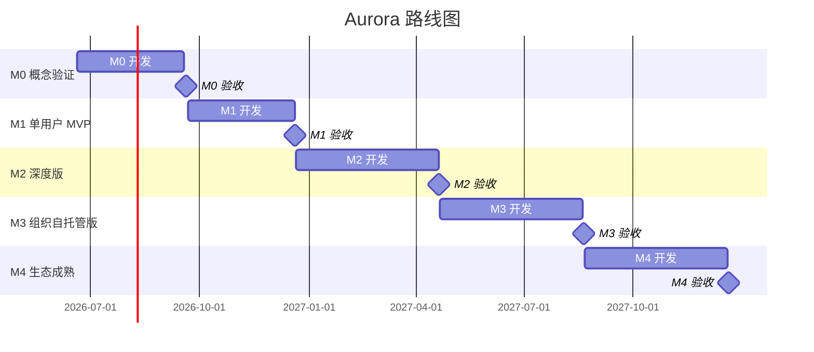

# Aurora 路线图：里程碑与验收标准

**版本**：0.3.0
**日期**：2026-06-30
**状态**：活跃
**分类**：06_roadmap — 路线图与验收标准

---

## 一、里程碑总览

---

## 二、M0：概念验证（2026-06-20 → 2026-09-20）

### 2.1 目标
证明"小波 + 三值"概念可行，让有困惑与洞察力的人能自行找来并验证（开源免费、不推广，靠自我筛选）。同时建立 SecurityMode 基础（Awareness/Transparency）。

### 2.2 功能范围

| 功能 | 说明 | 优先级 |
|------|------|--------|
| 邮件元数据采集 | 读取本地邮件客户端数据库，提取时间/频率/方向元数据 | P0 |
| 小波基频检测 | 对通信频率时间序列做 CWT，提取基频 | P0 |
| 简单 Trit-Core 集成 | 通信频率（Embodied）vs 用户自评（Individual）的 TAND | P0 |
| SecurityMode 基础 | 实现 Normal/Awareness/Transparency 三态，允许运算，只通知 | P0 |
| 静态 HTML 输出 | 简单的注意力图谱（雷达图 + 趋势图） | P0 |
| Rust CLI | 命令行工具，接受参数，输出 JSON/HTML | P0 |

### 2.3 技术范围

- 语言：Rust
- 库：trit-core（本地 crate）+ rustfft + 自研 CWT
- 输出：CLI 生成静态 HTML 文件
- 数据：SQLite + SQLCipher（本地加密）
- 加密：SQLCipher（AES-256-CBC + HMAC-SHA256），密钥用户持有[^1]

[^1]: SQLite 原生不支持加密。使用 SQLCipher（`rusqlite` 的 `bundled-sqlcipher` 特性）。

### 2.4 验收标准（Exit Criteria）

#### 功能验收

| 检查项 | 标准 | 验证方式 |
|--------|------|----------|
| ⏸ M1 | 邮件采集 | 能从至少一个邮件客户端（Apple Mail / Outlook / Thunderbird）读取元数据 | 手动测试（M0 仅完成 DataSource trait + JSON fallback） |
| ✅ 小波分析 | 对合成数据（已知频率的正弦波）能准确检测基频 | 自动化测试 |
| ✅ Trit-Core 集成 | 跨 Frame 冲突时输出 Hold + MetaInterrupt | 自动化测试 |
| ✅ SecurityMode | Awareness 状态不阻断运算，只返回通知 | 伦理门禁测试 |
| ✅ HTML 输出 | 生成的 HTML 在浏览器中可正常显示 | 手动测试 |
| ✅ CLI 可用 | 命令行参数正确解析，输出格式正确 | 自动化测试 |

#### 非功能验收

| 检查项 | 标准 | 验证方式 |
|--------|------|----------|
| ✅ 编译通过 | `cargo build --release` 成功 | CI |
| ✅ 测试通过 | `cargo test` 全部通过 | CI |
| ✅ 伦理门禁 | `cargo test ethics_` 全部通过 | CI |
| ✅ 无 unsafe | `cargo clippy` 无 unsafe 警告（Aurora 代码） | CI |
| ✅ 性能 | 日数据分析 < 1秒 | 手动计时 |
| ✅ 定心盘 | 通过 `TECH_REVIEW_CHECKLIST.md` 自检 | 手动 |

#### 用户验收

| 检查项 | 标准 | 验证方式 |
|--------|------|----------|
| ✅ 自我验证 | 作者能用 Aurora 检测到自己的通信节奏变化 | 亲历 |
| ✅ 早期反馈 | 至少 2 个外部用户试用并给出反馈 | 问卷/访谈 |

### 2.5 风险与缓解

| 风险 | 概率 | 影响 | 缓解 |
|------|------|------|------|
| 邮件客户端数据库格式不兼容 | 高 | 中 | 支持多种客户端，提供手动导入 |
| 小波分析性能不足 | 中 | 中 | 优化热路径，必要时降级到 DWT |
| Trit-Core 扩展导致不兼容 | 低 | 高 | 直接扩展 Frame enum，不 wrapper，保持向后兼容 |
| SecurityMode 被误实现为阻断 | 中 | 极高 | 伦理门禁测试强制检查 `allows_computation()` |

---

## 三、M1：单用户 MVP（2026-09-21 → 2026-12-20）

### 3.1 目标
发布可安装的桌面应用，建立自愿试用用户群（开源免费，不收费）。SecurityMode 完善（Awareness 检测 PolicyViolation）。

### 3.2 功能范围

| 功能 | 说明 | 优先级 |
|------|------|--------|
| 多数据源 | 邮件 + 日历 + 位置（可选）+ HRV（可选） | P0 |
| 完整小波分析 | 基频 + 谐波 + 相位漂移 + 频谱重构 | P0 |
| Tauri 桌面应用 | macOS / Windows / Linux 原生安装包 | P0 |
| 注意力图谱 | 实时可视化，可交互 | P0 |
| 冲突面板 | 跨域冲突清单 + Hold 解释（用户可覆盖） | P0 |
| 节奏报告 | 周/月报告，导出 PDF | P1 |
| 基础设置 | 数据源配置、告警阈值、隐私设置、SafeFallback 开关 | P0 |
| 数据导出 | 用户可随时导出全部数据（JSON/SQLite），无锁定期 | P0 |

### 3.3 验收标准（Exit Criteria）

#### 功能验收

| 检查项 | 标准 | 验证方式 |
|--------|------|----------|
| ✅ 多数据源 | 支持至少 3 种数据源（邮件、日历、位置） | 手动测试 |
| ✅ 小波完整 | 能检测基频、谐波、相位漂移 | 合成数据验证 |
| ✅ 桌面应用 | Tauri 应用能打包安装，UI 可用 | 手动测试 |
| ✅ 注意力图谱 | 实时更新，点击可查看详情 | 手动测试 |
| ✅ 冲突面板 | 跨域冲突正确显示，Hold 有解释，用户可覆盖 | 手动测试 |
| ✅ 数据导出 | 用户可导出全部数据（JSON/SQLite），无锁定期 | 手动测试 |
| ✅ SafeFallback 可关闭 | 用户可在设置中关闭 SafeFallback | 手动测试 |
| ✅ Awareness 通知 | 系统检测到策略违反时，返回通知但不阻断 | 伦理门禁测试 |

#### 非功能验收

| 检查项 | 标准 | 验证方式 |
|--------|------|----------|
| ✅ 离线可用 | 断网后所有功能正常 | 手动测试 |
| ✅ 内存 | 单用户 < 500MB | 压力测试 |
| ✅ 启动 | < 3秒 | 手动计时 |
| ✅ 安全 | cargo-audit 无已知高危 | CI |
| ✅ 伦理门禁 | `cargo test ethics_` 全部通过 | CI |
| ✅ 定心盘 | 通过 `TECH_REVIEW_CHECKLIST.md` 自检 | 手动 |

#### 反指标验收（替代商业验收）

| 检查项 | 标准 | 验证方式 |
|--------|------|----------|
| ✅ 自愿试用 | 至少 10 名试用者主动找来并反馈（不收费、不推广） | 反馈记录 |
| ✅ 依赖率下降 | 试用者对系统建议的依赖率呈下降趋势 | 审计日志 |
| ✅ 打开时长不追求 | 日均使用次数不被作为增长指标 | — |
| ✅ 画像维度 | 用户画像维度数仍为 0（禁止增长） | 代码审查 |

---

## 四、M2：深度版（2026-12-21 → 2027-04-20）

### 4.1 目标
支持公众人物、演员、高性能个体的专业需求，深化长见识输入（文化/风俗内容填充）。角色边界监控和环境冲击检测以 Awareness 模式运行（不阻断）。

### 4.2 功能范围

| 功能 | 说明 | 优先级 |
|------|------|--------|
| 地理生态框架 | 手动输入出生地/迁徙路径，自动推断认知模式 | P0 |
| 环境相位冲击 | 检测环境切换，分级预警（Awareness 通知），恢复曲线 | P0 |
| 角色边界监控 | 角色入侵检测、解离预警（Awareness 通知）、恢复仪式提醒 | P0 |
| 决策审计 | 每个建议附带完整 MetaInterrupt 日志，用户可覆盖 Hold | P1 |
| 高级可视化 | 小波尺度图、相位漂移图、频谱对比图 | P1 |
| 公开情报 | 定向抓取新闻/社交媒体，情绪分析（元数据，不读取内容） | P2 |
| 第三方安全审计 | 委托安全公司对加密方案、输入验证、审计日志进行审计 | P1 |

### 4.3 验收标准（Exit Criteria）

#### 功能验收

| 检查项 | 标准 | 验证方式 |
|--------|------|----------|
| ✅ 地理生态 | 至少支持 10 种环境类型的权重推断 | 手动测试 |
| ✅ 环境冲击 | 模拟环境切换，冲击等级正确，系统进入 Awareness 而非 SafeMode | 伦理门禁测试 |
| ✅ 角色监控 | 模拟角色入侵，污染检测正确，系统输出 Hold 但用户可覆盖 | 伦理门禁测试 |
| ✅ 决策审计 | 每个决策有可追溯的审计日志，用户可覆盖 | 手动测试 |
| ✅ 安全审计 | 第三方安全审计通过，无高危漏洞 | 审计报告 |

#### 反指标验收（替代商业验收）

| 检查项 | 标准 | 验证方式 |
|--------|------|----------|
| ✅ 深度试用 | 至少 5 名深度试用者持续使用并反馈（不收费） | 反馈记录 |
| ✅ 用户案例 | 至少 1 个可公开用户案例（脱敏，用户自愿） | 用户授权 |
| ✅ 画像维度 | 用户画像维度数仍为 0 | 代码审查 |
| ✅ 云同步频率 | 云端数据同步频率仍为 0（本地优先） | 代码审查 |

---

## 五、M3：组织自托管版（2027-04-21 → 2027-08-20）

### 5.1 目标
支持组织级部署，监控关键节点相变，节约负责人精力。组织级功能仍需遵循定心盘（不剥夺用户选择权）。

### 5.2 功能范围

| 功能 | 说明 | 优先级 |
|------|------|--------|
| 多用户管理 | 团队/组织内的用户管理 | P0 |
| 节点拓扑 | 组织内的人际关系与业务关系网络 | P0 |
| 节点相变检测 | 关键人物的相位变化检测（Awareness 通知） | P0 |
| 级联风险 | 相变的级联影响计算（用户可覆盖 Hold） | P0 |
| 组织涡旋模型 | 信息密度、角速度、涡旋强度可视化（类比模型） | P1 |
| 团队注意力图谱 | 多人注意力聚合与冲突检测 | P1 |
| 本地服务器 | 团队数据可选同步到本地服务器（端到端加密） | P1 |

### 5.3 验收标准（Exit Criteria）

#### 功能验收

| 检查项 | 标准 | 验证方式 |
|--------|------|----------|
| ✅ 用户管理 | 支持至少 100 人团队 | 手动测试 |
| ✅ 节点拓扑 | 能导入组织关系数据 | 手动测试 |
| ✅ 相变检测 | 模拟关键节点变化，系统正确检测，输出 Awareness 通知 | 伦理门禁测试 |
| ✅ 级联风险 | 级联风险计算与理论值一致，用户可覆盖 Hold | 自动化测试 |
| ✅ 个人数据加密 | 即使团队部署，个人数据仍本地加密，密钥用户持有 | 安全审计 |

#### 反指标验收（替代商业验收）

| 检查项 | 标准 | 验证方式 |
|--------|------|----------|
| ✅ 自托管试用 | 至少 2 个团队自部署并反馈（不收费） | 反馈记录 |
| ✅ 组织案例 | 至少 1 个可公开的组织案例（脱敏，自愿） | 客户授权 |
| ✅ 不进化 | 无任何基于用户数据的在线学习代码 | 代码审查 |

---

## 六、M4：生态成熟（2027-08-21 → 2027-12-20）

### 6.1 目标
生态成熟，长见识输入源覆盖全球气候/生态/地理/风俗，用户毕业路径清晰。定心盘不可妥协（即使组织要求"系统保护员工"）。

### 6.2 功能范围

| 功能 | 说明 | 优先级 |
|------|------|--------|
| 自托管部署 | 组织内网完整部署 | P0 |
| 自定义 Frame | 高级用户可定义自己的参考系（直接扩展 enum） | P1 |
| 自定义 Domain | 高级用户可定义自己的仲裁规则 | P1 |
| 长见识内容生态 | 全球气候/生态/地理/风俗内容持续填充 | P0 |
| 集中审计 | 组织级审计日志集中存储（但员工可导出个人副本） | P1 |
| 自愿工作坊 | 认知主权自愿工作坊（开源，不收费） | P2 |

**自托管伦理约束**：
- 即使组织部署，个人数据仍本地加密，密钥用户持有
- 组织管理员无法解密个人数据
- 系统不基于员工数据学习（不进化原则）
- 员工可关闭任何功能、导出全部数据、离开系统（不剥夺原则）
- 系统不代替组织决策（不自欺原则）
- 全部代码、逻辑、数据格式公开（公开可审查原则）

### 6.3 验收标准（Exit Criteria）

#### 功能验收

| 检查项 | 标准 | 验证方式 |
|--------|------|----------|
| ✅ 自托管部署 | 能在组织内网独立运行 | 手动测试 |
| ✅ 自定义协议 | 自定义 Frame/Domain 能正确工作（直接扩展 enum） | 自动化测试 |
| ✅ 长见识覆盖 | 长见识输入源覆盖主要气候带与文化圈 | 内容审查 |
| ✅ 个人数据主权 | 员工个人数据本地加密，组织无法解密 | 安全审计 |
| ✅ 定心盘 | 通过 `TECH_REVIEW_CHECKLIST.md` 自检 | 手动 |

#### 反指标验收（替代商业验收）

| 检查项 | 标准 | 验证方式 |
|--------|------|----------|
| ✅ 毕业信号 | 至少 1 个长期用户报告"已基本不再需要系统辅助" | 用户反馈 |
| ✅ 画像维度 | 用户画像维度数仍为 0 | 代码审查 |
| ✅ 推送频率 | 仅关键时刻触发，不追求打开次数 | 审计日志 |

---

## 七、Checklist（执行追踪）

### 每周 Checklist

- [ ] 本周代码提交数
- [ ] 本周测试通过率
- [ ] 本周伦理门禁测试通过率（`cargo test ethics_`）
- [ ] 本周性能基准变化
- [ ] 本周文档更新
- [ ] 本周用户反馈（如有）
- [ ] 本周 blocker 清单
- [ ] 下周优先级

### 每双周 Checklist

- [ ] 双周目标达成率
- [ ] 双周 bug 关闭率
- [ ] 双周性能回归检查
- [ ] 双周安全扫描（cargo-audit）
- [ ] 双周伦理门禁测试（`cargo test ethics_`）
- [ ] 双周文档评审
- [ ] 双周里程碑偏差检查
- [ ] 双周定心盘一致性检查（`TECH_REVIEW_CHECKLIST.md`）

### 每月 Checklist

- [ ] 月度里程碑进度
- [ ] 月度自愿试用者反馈（如有，不推广）
- [ ] 月度反指标检查（依赖率/画像维度/云同步频率是否仍达标）
- [ ] 月度技术债务评估
- [ ] 月度定心盘审计（代码是否背叛了 CHARTER.md）
- [ ] 下月目标调整

---

*本文档为 Aurora 的路线图与验收标准。v0.3.0（2026-06-30）：动机表述对齐 `docs/NARRATIVE_CHARTER.md`；移除全部商业验收（付费用户数/年收入/留存率/NPS），替换为反指标验收；里程碑命名去商业化（专业版→深度版、团队版→组织自托管版、企业版→生态成熟）。每个里程碑的 Exit Criteria 是硬性门槛，必须全部通过才能进入下一阶段。*
