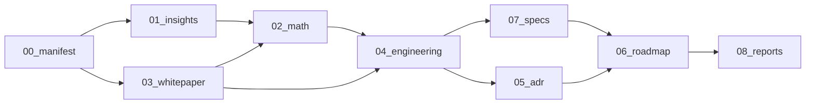

# Aurora 文档系统总索引

**项目代号**: Aurora  
**全称**: Attention Quantification & Decision Protocol System  
**版本**: 0.1.0  
**创建日期**: 2026-06-20  
**维护者**: 亲历者  
**协议**: MIT / 提醒，而非指教  
**状态**: 活跃开发 — M0 概念验证阶段  

---

## 目录结构

```
Aurora/
├── 00_manifest/          # 项目宣言与顶层设计
├── 01_insights/          # 洞见层 — 概念、哲学、工作假设
├── 02_math/              # 数学支持 — 场方程、小波变换、信息论
├── 03_whitepaper/        # 技术白皮书 — 协议规格、架构、接口
├── 04_engineering/       # 工程规格 — 大厂级开发规划、模块规格
├── 05_adr/               # 架构决策记录 — 每个关键决策的完整论证
├── 06_roadmap/           # 路线图与验收标准 — 里程碑、Checklist、Exit Criteria
├── 07_specs/             # 详细模块规格 — API 契约、数据模型、状态机
└── 08_reports/           # 报告模板 — 验证报告、审计报告、复盘报告
```

## 快速导航

| 读者角色 | 推荐阅读顺序 |
|----------|-------------|
| **新加入者 / 潜在合作者** | INDEX → 00_manifest/AURORA_MANIFEST.md → 01_insights/ → 03_whitepaper/EXECUTIVE_SUMMARY.md |
| **技术评审者 / 工程师** | 00_manifest/ → 03_whitepaper/ → 04_engineering/ → 07_specs/ → 05_adr/ |
| **投资人 / 商业决策者** | 00_manifest/ → 01_insights/COGNITIVE_SOVEREIGNTY.md → 03_whitepaper/EXECUTIVE_SUMMARY.md → 06_roadmap/ |
| **数学 / 理论研究者** | 02_math/ → 03_whitepaper/PROTOCOL_SPEC.md → 05_adr/ |
| **执行团队 / 开发者** | 06_roadmap/ → 04_engineering/ → 07_specs/ → 08_reports/ |

## 文档状态图



## 核心文档清单

### 00_manifest — 项目宣言
| 文档 | 状态 | 说明 |
|------|------|------|
| AURORA_MANIFEST.md | ✅ 完成 | 项目宣言、价值主张、核心假设 |

### 01_insights — 洞见层
| 文档 | 状态 | 说明 |
|------|------|------|
| COGNITIVE_SOVEREIGNTY.md | ✅ 完成 | 认知主权概念定义、与注意力资本主义的区分 |
| ENVIRONMENTAL_SHOCK.md | ✅ 完成 | 环境相位冲击理论、神经重塑模型 |
| ORGANIZATIONAL_VORTEX.md | ✅ 完成 | 组织涡旋动力学、分形同构 |
| ATTENTION_CAPITALISM.md | ✅ 完成 | 注意力资本主义的运作机制、系统级默化 |
| FRAME_EPISTEMOLOGY.md | ✅ 完成 | Frame 认识论：参考系作为认知基础设施 |

### 02_math — 数学支持
| 文档 | 状态 | 说明 |
|------|------|------|
| FIELD_EQUATIONS.md | ✅ 完成 | 组织涡旋的场方程、信息密度、角速度、涡旋强度 |
| WAVELET_ANALYSIS.md | ✅ 完成 | 小波变换的数学基础、认知特征提取公式 |
| INFORMATION_THEORY.md | ✅ 完成 | 信息论视角：熵、保真度、相变、级联 |
| PHASE_ARITHMETIC.md | ✅ 完成 | Phase 算术的形式化、与 Trit-Core 的映射 |

### 03_whitepaper — 技术白皮书
| 文档 | 状态 | 说明 |
|------|------|------|
| EXECUTIVE_SUMMARY.md | ✅ 完成 | 一页纸版本：问题、方案、壁垒、商业模式 |
| PROTOCOL_SPEC.md | ✅ 完成 | Aurora 协议规格：Frame、Domain、环境冲击、角色边界 |
| ARCHITECTURE.md | ✅ 完成 | 系统架构：五层设计、数据流、模块依赖 |
| API_CONTRACT.md | ✅ 完成 | 公共 API 契约：输入/输出、错误处理、版本策略 |
| SECURITY_MODEL.md | ✅ 完成 | 安全模型：威胁分析、数据主权、本地优先 |

### 04_engineering — 工程规格
| 文档 | 状态 | 说明 |
|------|------|------|
| SYSTEM_DESIGN.md | ✅ 完成 | 系统设计：大厂级设计文档（PRD + 技术规格） |
| DATA_MODEL.md | ✅ 完成 | 数据模型：实体关系、Schema、迁移策略 |
| PIPELINE_DESIGN.md | ✅ 完成 | 管道设计：从原始数据到决策输出的完整链路 |
| TESTING_STRATEGY.md | ✅ 完成 | 测试策略：单元测试、集成测试、属性测试、性能测试 |
| DEPLOYMENT_GUIDE.md | ✅ 完成 | 部署指南：本地、团队、企业级部署 |

### 05_adr — 架构决策记录
| 文档 | 状态 | 说明 |
|------|------|------|
| 001-local-first.md | ✅ 完成 | ADR-001：本地优先架构 |
| 002-wavelet-over-fft.md | ✅ 完成 | ADR-002：小波变换 vs 傅里叶变换 |
| 003-ternary-over-binary.md | ✅ 完成 | ADR-003：三值协议 vs 二值概率 |
| 004-geoeco-frame.md | ✅ 完成 | ADR-004：地理生态参考系的引入 |
| 005-rust-over-python.md | ✅ 完成 | ADR-005：Rust 作为主要实现语言 |
| 006-tauri-over-electron.md | ✅ 完成 | ADR-006：Tauri 作为桌面框架 |
| 007-sqlite-over-postgres.md | ✅ 完成 | ADR-007：SQLite 作为本地数据库 |
| 008-subscription-over-ads.md | ✅ 完成 | ADR-008：订阅制 vs 广告模式 |

### 06_roadmap — 路线图与验收标准
| 文档 | 状态 | 说明 |
|------|------|------|
| MILESTONES.md | ✅ 完成 | 里程碑定义：M0 → M1 → M2 → M3 → M4 |
| MVP_EXIT_CRITERIA.md | ✅ 完成 | MVP 验收标准：功能、性能、安全、质量 |
| M1_EXIT_CRITERIA.md | ✅ 完成 | M1 验收标准 |
| M2_EXIT_CRITERIA.md | ✅ 完成 | M2 验收标准 |
| M3_EXIT_CRITERIA.md | ✅ 完成 | M3 验收标准 |
| M4_EXIT_CRITERIA.md | ✅ 完成 | M4 验收标准 |

### 07_specs — 详细模块规格
| 文档 | 状态 | 说明 |
|------|------|------|
| DATA_INGESTION_SPEC.md | ✅ 完成 | 数据采集模块规格 |
| WAVELET_ENGINE_SPEC.md | ✅ 完成 | 小波引擎模块规格 |
| FRAME_MODEL_SPEC.md | ✅ 完成 | 参考系建模模块规格 |
| TRIT_CORE_INTEGRATION_SPEC.md | ✅ 完成 | Trit-Core 集成规格 |
| UI_SPEC.md | ✅ 完成 | 用户界面规格 |
| ALERT_ENGINE_SPEC.md | ✅ 完成 | 告警引擎规格 |

### 08_reports — 报告模板
| 文档 | 状态 | 说明 |
|------|------|------|
| VALIDATION_REPORT_TEMPLATE.md | ✅ 完成 | 验证报告模板 |
| SECURITY_AUDIT_TEMPLATE.md | ✅ 完成 | 安全审计模板 |
| PERFORMANCE_REPORT_TEMPLATE.md | ✅ 完成 | 性能报告模板 |
| RETROSPECTIVE_TEMPLATE.md | ✅ 完成 | 复盘报告模板 |

---

## 变更记录

| 日期 | 版本 | 变更 |
|------|------|------|
| 2026-06-20 | 0.1.0 | 初始创建，完整文档系统（40+份文档） |

---

*本索引为 Aurora 文档系统的入口。所有文档的创建、修改、归档均在此记录。不是指教，是提醒。*
