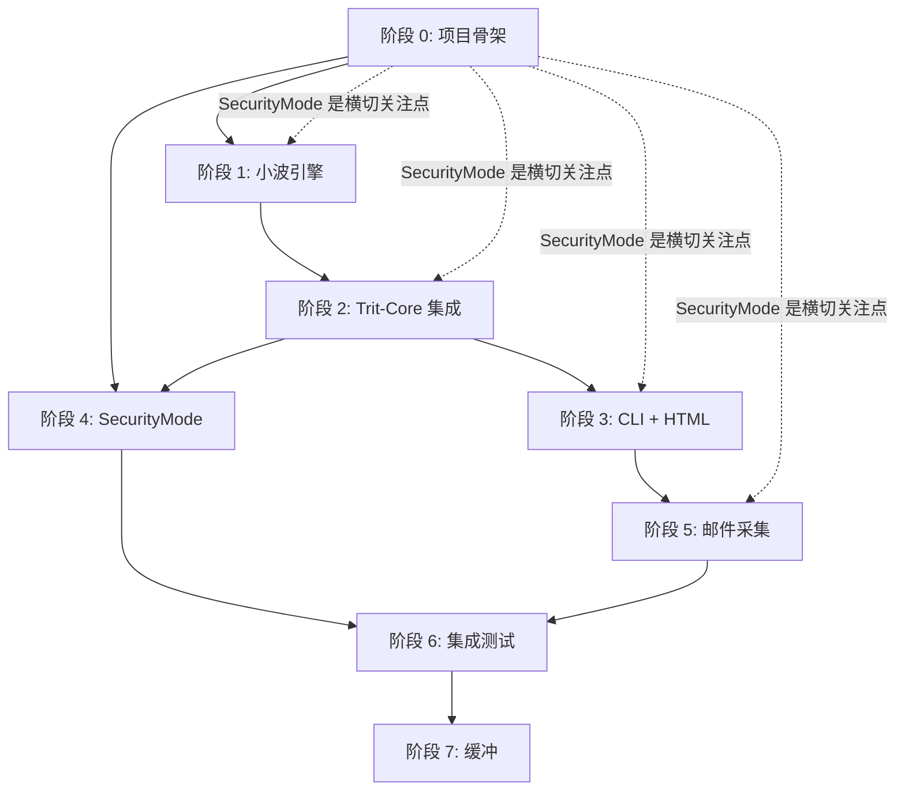

# Aurora 项目主计划（Master Plan）

> **唯一入口**：任何新加入的协作者（AI 或人类），从此文件开始。不要先读 aurora/ 下的其他文档——先理解这份计划，再按步骤深入。
>
> **当前状态**：M0 概念验证，第 1 天（2026-06-20）。Aurora 目前只有文档，没有可运行代码。本计划的任务是把文档转化为代码。
>
> **版本**：0.1.0  
> **协议**：MIT / 提醒，而非指教  
> **状态**：活跃 — 此计划本身随项目进展迭代

---

## 一、唯一的第一优先级

**第一优先级**：建立一个**可运行的端到端原型**（合成数据版本）。

具体来说：

> 一个 Rust CLI 二进制，输入是合成通信频率数据（正弦波），经过小波变换提取基频，送入 Trit-Core 做三值决策（Embodied vs Individual），输出 Hold/True/False + MetaInterrupt 解释，渲染为静态 HTML。

**为什么这是第一优先级**：

| 理由 | 说明 |
|------|------|
| 不依赖外部系统 | 不需要邮件客户端、不需要真实用户数据。合成数据是 100% 可控的。 |
| 验证核心假设 | M0 的全部价值就是证明"小波 + 三值"可行。如果合成数据版本都不能工作，真实数据更不可能。 |
| 建立测试基准 | 合成数据是已知的（"输入是 2Hz 正弦波，输出应该检测到 2Hz"），可以建立自动化测试。 |
| 给后续开发提供骨架 | 邮件采集、SecurityMode、多数据源都是在这个骨架上增量添加。 |
| 不阻塞、不等待 | 不需要等待用户反馈、不需要等待第三方 API、不需要等待硬件。 |

**第一优先级的反模式**：

- ❌ 先写邮件采集（格式不兼容风险高，阻塞一切）
- ❌ 先写 HTML 渲染（没有数据，渲染什么？）
- ❌ 先写 SecurityMode 的完整策略（策略需要功能存在才能测试）
- ❌ 先读完全部 60 份文档（阅读成本 > 执行成本）

---

## 二、执行顺序（依赖图）

以下是 M0 的**不可并行**执行顺序。每个阶段必须完成并验证，才能进入下一阶段。

```
阶段 0: 项目骨架（1-2 天）
    │
    ├── 创建 Cargo.toml、目录结构、CI 流水线
    ├── 集成 trit-core（本地 path 依赖）
    └── 建立测试框架（cargo test 骨架）
    │
阶段 1: 合成数据 + 小波引擎（第 1-2 周）
    │
    ├── 合成数据生成器：已知频率的正弦波 + 可控噪声
    ├── CWT（连续小波变换）或 rustfft 的基频检测
    └── 单元测试："输入 2Hz，输出 2Hz ± 容差"
    │
阶段 2: Trit-Core 集成（第 2-3 周）
    │
    ├── 将基频映射为 Embodied 帧（通信节奏的物理信号）
    ├── 将用户设定映射为 Individual 帧（用户自评状态）
    ├── TAND 运算：Embodied vs Individual → 跨域冲突检测
    └── 单元测试：冲突时输出 Hold + MetaInterrupt，非冲突时输出 True/False
    │
阶段 3: CLI + HTML 输出（第 3-4 周）
    │
    ├── CLI 参数解析（输入文件路径、输出目录、用户设定）
    ├── JSON 输出格式（结构化决策结果）
    └── 静态 HTML 渲染（雷达图 + 趋势图，plotters 或类似库）
    │
阶段 4: SecurityMode 基础（第 4-5 周，贯穿）
    │
    ├── 实现 Normal/Awareness/Transparency 三态枚举
    ├── 在 TAND 运算中嵌入 Awareness 检测（不阻断，只通知）
    ├── 伦理门禁测试：cargo test ethics_（不可跳过的 10 个测试）
    └── 定心盘自检：对照 CHARTER.md 的 4 条底线逐项检查
    │
阶段 5: 邮件采集（第 5-6 周）
    │
    ├── 读取至少一种邮件客户端数据库（Apple Mail 优先，结构最简单）
    ├── 提取时间/频率/方向元数据（不读取邮件内容，只读元数据）
    ├── 将邮件采集替换合成数据输入
    └── 端到端测试：真实邮件数据 → 小波 → 三值 → HTML
    │
阶段 6: 集成测试与优化（第 6-8 周）
    │
    ├── 日数据分析性能优化（目标 < 1 秒）
    ├── 作者自我验证（用自己的邮件数据跑通）
    ├── 至少 2 个外部用户试用并反馈
    └── 通过 MVP_EXIT_CRITERIA.md 全部验收标准
    │
阶段 7: 缓冲与文档（第 8-12 周）
    │
    ├── 修复 M0 中发现的问题
    ├── 更新文档（代码变更后同步文档）
    └── 准备 M1（个人版 MVP）的入口
```

---

## 三、每个阶段的唯一入口

### 阶段 0：今天做什么？

**任务**：创建 `aurora/` 代码目录和 `Cargo.toml`。

**打开的文件**：
1. `trit-core/Cargo.toml`（参考 trit-core 的依赖结构）
2. `aurora/07_specs/TRIT_CORE_INTEGRATION_SPEC.md`（了解如何集成 trit-core）
3. `aurora/05_adr/005-rust-over-python.md`（确认 Rust 技术栈选择）

**产出**：
- `aurora/Cargo.toml`（依赖：trit-core（path）、rusqlite（bundled-sqlcipher）、plotters、anyhow、clap）
- `aurora/src/main.rs`（CLI 入口，hello world）
- `aurora/src/lib.rs`（库入口）
- `aurora/tests/` 目录（测试骨架）
- `.github/workflows/ci.yml`（CI 流水线，复制 trit-core 的并修改）

**验证标准**：`cargo build` 成功，`cargo test` 通过（空测试也算通过）。

---

### 阶段 1：合成数据 + 小波引擎

**任务**：让程序能"听懂"频率。

**打开的文件**：
1. `aurora/02_math/WAVELET_ANALYSIS.md`（数学原理）
2. `aurora/07_specs/WAVELET_ENGINE_SPEC.md`（实现规格）
3. `aurora/05_adr/002-wavelet-over-fft.md`（为什么选小波）

**产出**：
- `aurora/src/wavelet/` 目录
- `aurora/src/wavelet/synthetic.rs`（合成数据生成器）
- `aurora/src/wavelet/cwt.rs`（连续小波变换）
- `aurora/src/wavelet/detect.rs`（基频检测）
- `aurora/tests/wavelet_detect.rs`（单元测试：合成数据 → 基频）

**验证标准**：`cargo test wavelet` 全部通过。输入 2Hz 正弦波，输出 2.0 ± 0.1Hz。

---

### 阶段 2：Trit-Core 集成

**任务**：让程序能"决策"。

**打开的文件**：
1. `aurora/07_specs/TRIT_CORE_INTEGRATION_SPEC.md`（集成规格）
2. `aurora/03_whitepaper/PROTOCOL_SPEC.md`（协议规格）
3. `aurora/05_adr/003-ternary-over-binary.md`（三值决策的理由）
4. `docs/explanation/CONCEPTS.md`（TritValue、Frame、Phase 的定义）

**产出**：
- `aurora/src/decision/` 目录
- `aurora/src/decision/adapter.rs`（将小波输出映射为 TritWord）
- `aurora/src/decision/conflict.rs`（跨域冲突检测）
- `aurora/tests/decision_conflict.rs`（单元测试：冲突 → Hold + MetaInterrupt）

**验证标准**：`cargo test decision` 全部通过。Embodied（高频率）与 Individual（"我感觉正常"）冲突时，输出 Hold。

---

### 阶段 3：CLI + HTML 输出

**任务**：让程序能"展示"。

**打开的文件**：
1. `aurora/07_specs/UI_SPEC.md`（UI 规格）
2. `aurora/04_engineering/PIPELINE_DESIGN.md`（管道设计）

**产出**：
- `aurora/src/cli.rs`（命令行参数解析，clap）
- `aurora/src/render/html.rs`（静态 HTML 生成，plotters）
- `aurora/src/render/json.rs`（JSON 输出）
- `aurora/tests/cli_end_to_end.rs`（端到端测试：CLI 输入 → HTML 输出）

**验证标准**：`cargo run -- --input synthetic_2hz.json --output report.html` 成功生成可读的 HTML 文件。

---

### 阶段 4：SecurityMode 基础

**任务**：让程序"不越界"。

**打开的文件**：
1. `aurora/00_manifest/CHARTER.md`（四条底线：不剥夺、不自欺、不进化、公开可审查）
2. `aurora/05_adr/009-ethics-hardening.md`（伦理硬化决策）
3. `aurora/03_whitepaper/SECURITY_MODEL.md`（安全模型）
4. `aurora/04_engineering/TESTING_STRATEGY.md`（伦理门禁测试）

**产出**：
- `aurora/src/security/` 目录
- `aurora/src/security/mode.rs`（SecurityMode 枚举：Normal/Awareness/Transparency）
- `aurora/src/security/audit.rs`（审计日志）
- `aurora/tests/ethics_*.rs`（伦理门禁测试，10 个，不可跳过）

**验证标准**：`cargo test ethics_` 全部通过。系统检测到策略违反时，返回 Awareness 通知但不阻断运算。

---

### 阶段 5：邮件采集

**任务**：让程序"读懂"真实世界。

**打开的文件**：
1. `aurora/07_specs/DATA_INGESTION_SPEC.md`（数据采集规格）
2. `aurora/04_engineering/DATA_MODEL.md`（数据模型）

**产出**：
- `aurora/src/ingest/` 目录
- `aurora/src/ingest/mail.rs`（邮件客户端读取，Apple Mail 优先）
- `aurora/src/ingest/schema.rs`（元数据 Schema）
- `aurora/tests/ingest_mail.rs`（单元测试：读取测试数据库）

**验证标准**：`cargo test ingest` 全部通过。能从 Apple Mail 的 SQLite 数据库读取时间/频率/方向元数据。

**风险**：邮件客户端格式不兼容。缓解方案：如果 Apple Mail 失败，提供手动导入 JSON 格式。

---

### 阶段 6：集成测试与优化

**任务**：让程序"好用"。

**打开的文件**：
1. `aurora/06_roadmap/MVP_EXIT_CRITERIA.md`（验收标准）
2. `aurora/04_engineering/TECH_REVIEW_CHECKLIST.md`（技术审查清单）

**产出**：
- `aurora/tests/integration_*.rs`（端到端集成测试）
- `aurora/benches/`（性能基准）
- 修复清单（Issue Tracker）

**验证标准**：通过 `MVP_EXIT_CRITERIA.md` 全部检查项。日数据分析 < 1 秒。

---

### 阶段 7：缓冲与文档

**任务**：让项目"准备好进入 M1"。

**产出**：
- 更新 `aurora/` 文档（代码变更后的同步）
- 更新 `map/` MOC 文件（新增代码文件的跨链连接）
- 准备 M1（个人版 MVP）的技术债务清单

---

## 四、阻塞关系图



**关键规则**：

- **实线箭头** = 硬依赖。阶段 2 不能开始，除非阶段 1 完成（没有数据，无法做决策）。
- **虚线箭头** = 横切关注点。SecurityMode 贯穿所有阶段，但可以在阶段 0 建立框架，后续阶段填充检测逻辑。
- **无箭头** = 不可并行。虽然 SecurityMode 和 CLI 没有直接依赖，但它们共享阶段 2 的输出（决策结果），所以阶段 3 和阶段 4 在阶段 2 完成后可以部分并行。

---

## 五、每周检查点

| 周次 | 目标 | 验证方式 | 不通过怎么办 |
|------|------|----------|-------------|
| W1 | 项目骨架 + 合成数据生成器 | `cargo test synthetic` 通过 | 简化合成数据（从正弦波开始，不加噪声） |
| W2 | 小波基频检测 | `cargo test wavelet` 通过 | 降级到 DWT（离散小波变换），先证明概念 |
| W3 | Trit-Core 集成（合成数据） | `cargo test decision` 通过 | 检查 trit-core 版本兼容性，必要时升级 |
| W4 | CLI + HTML 原型 | `cargo run -- ...` 生成可读 HTML | 简化 HTML（先纯文本表格，再图表） |
| W5 | SecurityMode 框架 + 伦理门禁测试 | `cargo test ethics_` 全部通过 | 逐条对照 CHARTER.md，找出违背点 |
| W6 | 邮件采集（Apple Mail） | `cargo test ingest` 通过 | 提供手动导入 JSON 作为 fallback |
| W7 | 端到端集成（真实数据） | 作者用自己的数据跑通 | 修复数据源格式问题 |
| W8 | 性能优化 + 自我验证 | 日数据 < 1 秒 | 优化小波热路径，或降低分析频率 |
| W9-12 | 外部用户试用 + 文档更新 | 2 个外部用户反馈 | 收集反馈，修复 blocker，不新增功能 |

---

## 六、新协作者速查

### 如果你今天加入项目：

1. **读这个文件**（你现在正在读的）。理解第一优先级和当前阶段。
2. **确认当前阶段**：检查 `aurora/MASTER_PLAN.md` 顶部的"当前状态"行。
3. **打开对应阶段的入口**：按"每个阶段的唯一入口"中的文件列表开始工作。
4. **不要读其他文件**（除非当前阶段明确要求）。
5. **提交代码前运行**：`cargo test && cargo clippy && cargo fmt --check`

### 如果你想知道项目全貌：

- **5 分钟**：读 `map/00_START_HERE.md`（双螺旋知识库入口）
- **15 分钟**：读 `aurora/00_manifest/CHARTER.md` + `aurora/00_manifest/FIRST_PRINCIPLES.md`
- **30 分钟**：读 `aurora/03_whitepaper/EXECUTIVE_SUMMARY.md`（一页纸版本）
- **1 小时**：浏览 `map/` 的 8 个 MOC 文件

### 如果你遇到决策困境：

1. 对照 `aurora/00_manifest/CHARTER.md` 的 4 条底线
2. 对照 `aurora/04_engineering/TECH_REVIEW_CHECKLIST.md` 的 8 大维度
3. 对照 `aurora/06_roadmap/MVP_EXIT_CRITERIA.md` 的验收标准
4. 如果仍无法决定，在 `map/00_START_HERE.md` 的"维护约定"节记录问题

---

## 七、定心盘检查

每月执行一次（或每当重大决策时）：

| 检查项 | 标准 | 当前状态 |
|--------|------|----------|
| 不剥夺 | 用户可关闭任何功能、导出数据、离开系统 | ⬜ 待验证（M1 必须实现） |
| 不自欺 | 系统不猜测、不消冲突、不隐藏不确定性 | ⬜ 待验证（SecurityMode 测试中） |
| 不进化 | 系统出厂设置不变，不基于用户数据学习 | ✅ 代码层面：无机器学习、无训练循环 |
| 公开可审查 | 全部逻辑、代码、数据格式公开 | ✅ MIT 协议 + 代码公开 |

---

## 八、与现有文档的关系

| 现有文档 | 在计划中的作用 | 何时读 |
|----------|--------------|--------|
| `aurora/00_manifest/` | 决策锚点 | 遇到伦理困境时 |
| `aurora/01_insights/` | 设计灵感 | 理解"为什么"时，不是"怎么做"时 |
| `aurora/02_math/` | 实现参考 | 写对应模块代码时 |
| `aurora/03_whitepaper/` | 架构蓝图 | 设计新模块时 |
| `aurora/04_engineering/` | 工程约束 | 写测试、CI、部署时 |
| `aurora/05_adr/` | 决策理由 | 需要修改已有决策时 |
| `aurora/06_roadmap/` | 验收标准 | 阶段完成时验证 |
| `aurora/07_specs/` | 实现细节 | 对应阶段开发时 |
| `aurora/08_reports/` | 报告模板 | 阶段验收时 |
| `map/` | 跨链导航 | 需要追踪概念与代码的对应关系时 |

**原则**：先读 MASTER_PLAN，再按阶段读对应文档。不要一上来就读 60 份文件。

---

*本计划为 Aurora 的唯一执行入口。任何与计划的偏差必须经过记录和理由说明。不是指教，是提醒。*
