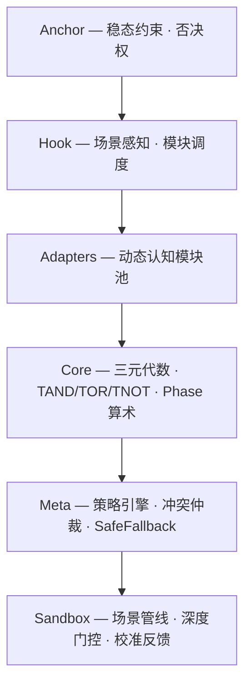

# README.md Redesign: Elegance + Technical Signal

**Date:** 2026-06-20
**Status:** design
**Scope:** `README.md`

## Motivation

Current README (163 lines):
- Information overload: 15 doc links, stale v0.2.0 highlights, archaeology milestones
- No visual hook: academic prose wall, no diagram, no code-first impression
- Missing new modules: budget, calibration, attention, knowledge not mentioned
- Rating: function 6/10, elegance 3/10

Goal: 80-100 lines. 30 seconds to understand value. Crawler-friendly. Appeals to technical talent.

## Design

### Structure (6 segments)

| # | Content | Rationale |
|---|---------|-----------|
| 1 | Title + one-liner + badges | Identity signal |
| 2 | 5-layer mermaid architecture diagram | Systems engineer sees full picture in one glance |
| 3 | Core insight: why Hold matters | Philosophical hook — "be moved before being retained" |
| 4 | 3-line code example (TAND → Hold) | Prove it's real, not vaporware |
| 5 | Build/test/run commands | 30 seconds to play |
| 6 | 3 links only: INDEX, Quickstart, Whitepaper | README is entry, not exit |

### Removed content

- v0.2.0 Highlights — archaeology, irrelevant to new visitors
- Technology Stack — obvious from Cargo.toml
- Project Structure table — replaced by mermaid diagram
- Key Results (M2 Validation) — lives in whitepaper
- Milestones table — archaeology
- 15 doc links — reduced to 3
- Epistemic humility quote — stays in its own doc

### Mermaid diagram

### Non-goals

- Not a full documentation system (that's docs/INDEX.md)
- Not a pitch deck
- Not replacing the whitepaper
